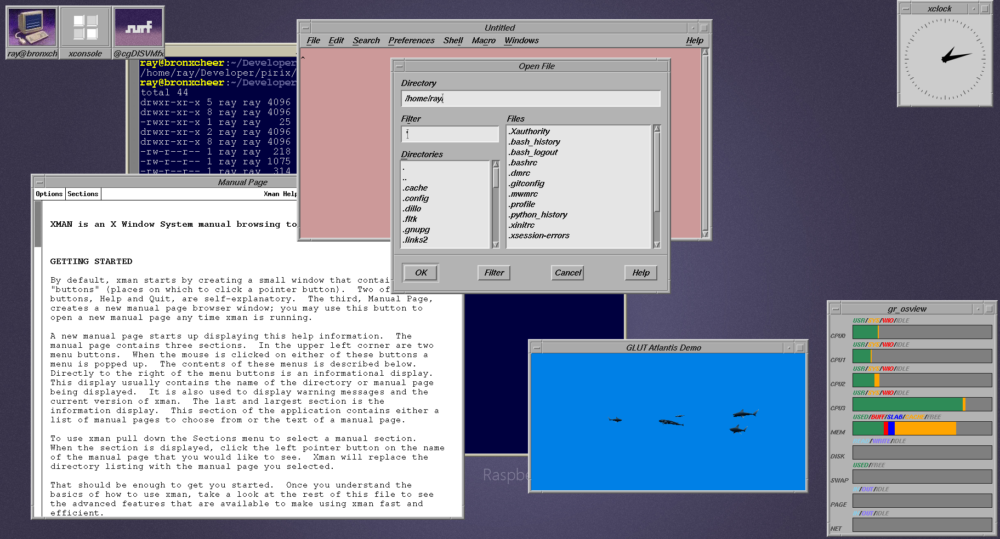
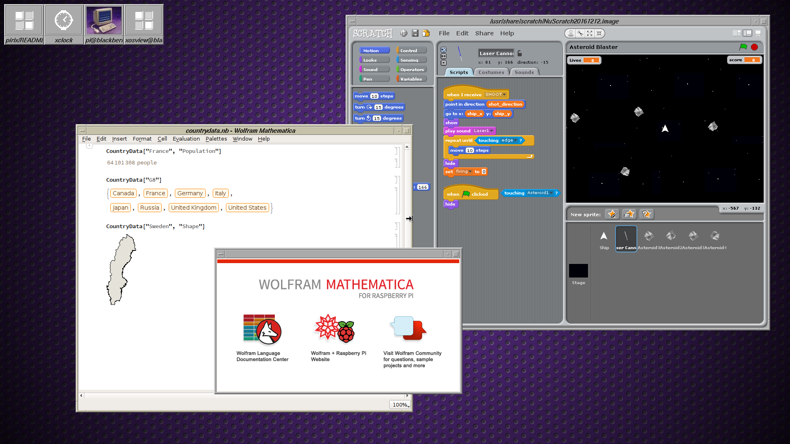
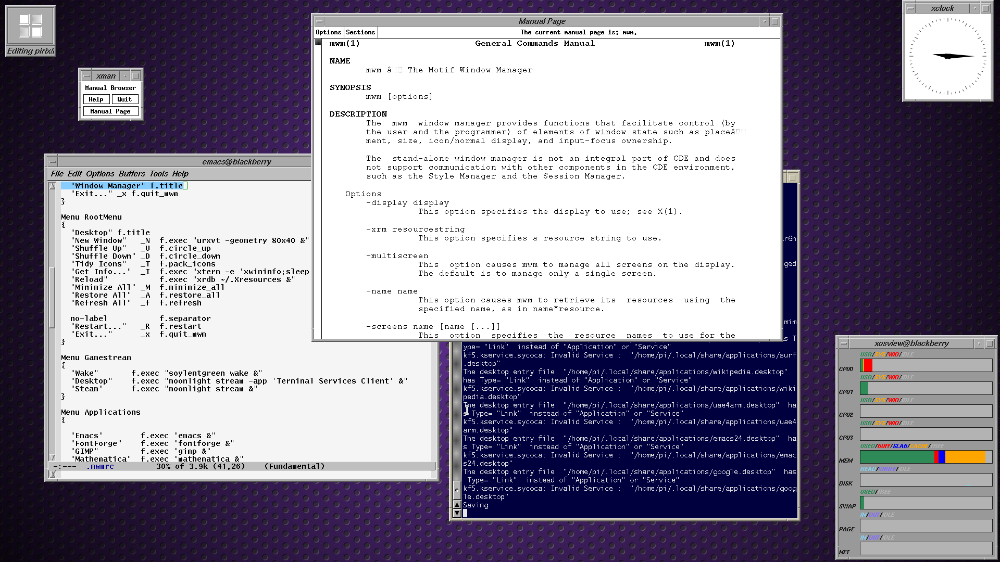

# piRIX

piRIX is an emulation of SGI's IRIX Interactive Desktop on Raspberry Pi 3/4
(and some other platforms).

Besides being nostalgic, this desktop environment is fast and easy on Pi 
resources.

## Installation

On Debian distributions, you'll need a few packages first. Run

    sudo apt install \
    mwm libmotif-dev motif-clients \
    xosview xfonts-100dpi xfonts-75dpi x11-apps libxi-dev libxm-dev \
    freeglut3-dev rxvt-unicode firefox-esr nedit xloadimage \
    imagemagick

As usual, Fedora distributions will use different names for these packages.

Then install:

    make install

Put this in your $HOME/.xinitrc :

    . $HOME/.config/pirix/pirixrc
    pirix

If you're booting directly to PIXEL Desktop, change your boot setting
with `raspi-config` to drop into a shell. Then run

    startx

## What Gets Installed?

Files will be installed to

    $HOME/.config/pirix

Please check that this won't stomp anything you want to keep.

## Removal

    rm -r $HOME/.config/pirix

and undo anything you did to `$HOME/.xinitrc`.

## Where is the Toolchest?

There ain't none.
Find a compromise by pressing your left mouse button
over the desktop root window.

## Goodies

If you want the atlantis demo,

    cd src/demo/atlantis
    make install

Follow the same pattern for any of the other demos.
The Toolchest (well, the thing that must serve for it)
has menu items to launch them.

## Does this hackamadoodle only work on the Pi?

Actually it ought to work in many other Linux contexts, like clan Debian
or clan Fedora.  There have been minor problems with OpenBSD but we hear
it still works.

This hackamadoodle really just sets resources for `mwm` so that you get
that CDE-like feeling.  So if your whatever-NIX has `mwm` you're mostly
there. For example, WSL2 has `mwm` so @rhaleblian runs this in Windows too,
using the X410 app ...

If you get it working in macOS, post about that.

## Notes

SGI's Indigo Magic Desktop and Interactive Desktop seem to bear similaries
to CDE and Motif; accordingly, this tweak bases itself on `mwm` at el.

A lot of things aren't here, including
* styling modifications to Motif (those rounded windows and scrollbars)
* the toolchest (i think you could write an Xm app of buttons with menus
  and no frame)
* the file manager (remember that they drew scalable vector icons)
* a contemporary web browser (Netscape Navigator or NCSA Mosaic)

Firefox is the defined browser, in the spirit of being a successor
to Navigator.

## TODO

* somebody write a toolchest replacement
* there's a starting point for a file manager at src/pirix/filemanager
* add icon images for more applications
* other omissions mentioned in the notes you may have just read

## Credits

* IRIX - Silicon Graphics Computer Systems
* Motif - The Open Group
* GL Demos - opengl.org
