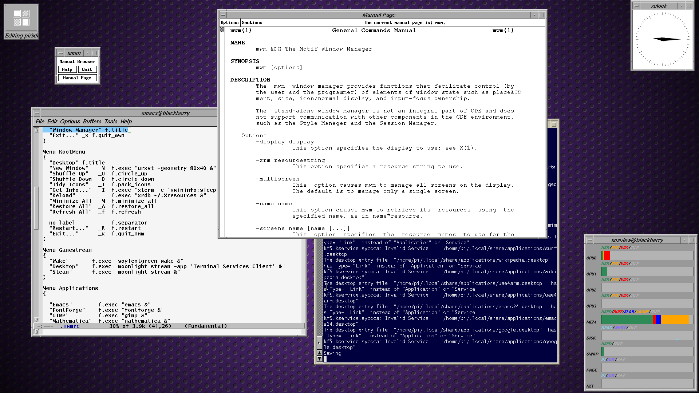
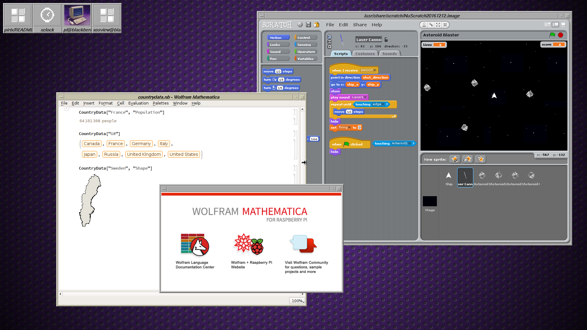

# pirix

PIRIX is an emulation of SGI's IRIX desktop environment on Raspberry Pi 3.

Besides being nostalgic, this desktop enviroment is fast and easy on Pi resources.

## Installation

Examine the 'install' Make rule and confirm it won't whack any file you want to keep:

    cat src/Makefile

If it's safe, invoke the rule via 

    make install

Let mwm see PIRIX' configuration for it:

    cd $HOME
    ln -s .config/pirix/mwmrc .mwmrc

Put this in your $HOME/.xinitrc :

    . /home/pi/.config/pirix/pirixrc
    pirix

Finally, run

    startx

## Goodies

If you want the atlantis demo,

    cd src/demo/atlantis
    make
    ./atlantis

Follow the same pattern for the ideas and glutmech demos.

## Notes

SGI's Indigo Magic Desktop and Interactive Desktop were derivations from the Motif Window Manager;
accordingly, this tweak bases itself on mwm.

A lot of things aren't here, including
* styling modifications to MWM (those rounded windows and scrollbars)
* the toolchest (i think you could write an Xm app of buttons with menus and no frame)
* the file manager (remember that they drew scalable vector icons)
* a contemporary web browser (Netscape Navigator or NCSA Mosaic)

## TODO

* somebody write a toolchest replacement
* there's a starting point for a file manager at src/pirix/filemanager
* add icon images for more applications
* other omissions mentioned in the notes you may have just read

## Credits

* IRIX - Silicon Graphics Computer Systems
* Motif - The Open Group
* GL Demos - opengl.org

